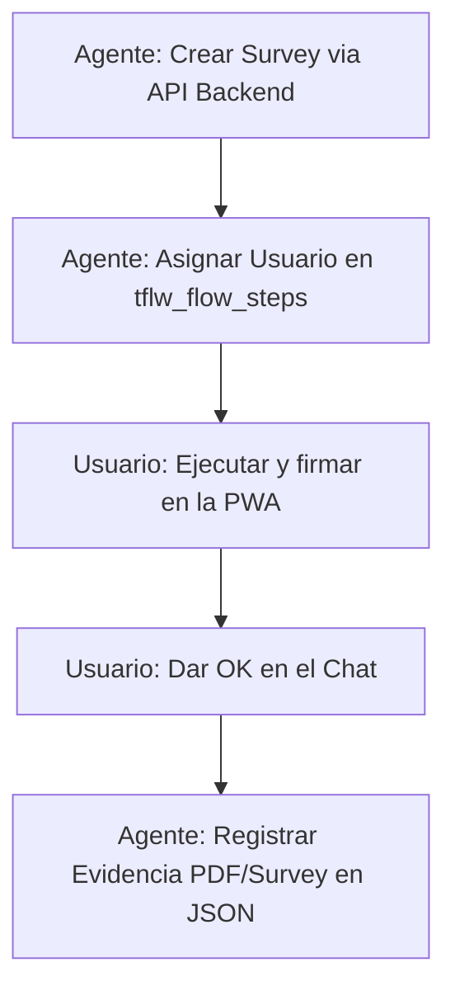

# 📋 SECUENCIA DE PRUEBA: GENERACIÓN Y FIRMA DE SURVEYS (TERRACON-QA)

Este documento define las reglas de conducta y la secuencia de pasos obligatoria que debe seguir la IA para generar surveys de prueba, asignarle el usuario del flujo, permitir que el usuario firme, y registrar las evidencias.

---

## 🚨 REGLA CRÍTICA: NO MEZCLAR PROYECTOS
Antes de tomar cualquier acción, identifica en qué directorio y base de datos estás parado:
* **Terracon PWA** (`terracon-pwa`): Base de datos de QA (`sch_leansurvey_qa`), usuario Sergio = `327`, puerto del backend = `3003`.
* **Transmac** (`Transmac`): Base de datos de dev (`sch_leantransmac_dev`), usuario Sergio = `14`, puerto del backend = `3004`.

---

## 🔄 SECUENCIA DE TRABAJO (TESTING-FLOW)

La secuencia acordada para pruebas funcionales y reporte de hallazgos es estrictamente la siguiente:



### Paso 1: Generar el Survey (Agente)
**NUNCA intentes insertar el survey con INSERT SQL manuales en frío**, ya que corrompe la integridad del flujo en la base de datos.
* Debes llamar al endpoint del backend local en el puerto **`3003`** (QA) a través de un script Node temporal ejecutado en el servidor mediante SSH.
* **Endpoint:** `POST http://localhost:3003/api/survey`
* **Payload Base:**
  ```json
  {
    "id_tipo_srv": 36,
    "id_template": 74,
    "id_user": 327,
    "id_user_creacion": 327,
    "id_empresa_cliente": 3,
    "estado_srv": "Creado",
    "header_seed": tmpl.header_seed,
    "body_seed": tmpl.body_seed,
    "approval_seed": tmpl.approval_seed,
    "header_exec": tmpl.header_seed,
    "body_exec": tmpl.body_seed,
    "approval_exec": tmpl.approval_seed,
    "fecha_plan_ini": "YYYY-MM-DD",
    "fecha_plan_fin": "YYYY-MM-DD",
    "id_proyecto": 9,
    "id_flow_tmpl": tmpl.id_flow_tmpl
  }
  ```

### Paso 2: Asignar el Usuario al Flujo (Agente)
Al crearse el survey mediante el endpoint, el backend generará de forma automática el flujo y los pasos. Inmediatamente después de obtener el `idSurvey` de éxito, debes ejecutar una query para asignar a Sergio (`327`) en todos los pasos de ese flujo:
```sql
UPDATE sch_leansurvey_qa.tflw_flow_steps 
SET id_user = 327 
WHERE id_flow = (SELECT id_flow FROM sch_leansurvey_qa.tflw_flows WHERE id_survey = {NUEVO_SURVEY_ID});
```

### Paso 3: Ejecución y Firma (Usuario)
El usuario entra a la PWA de QA logueado con su cuenta, completa la ejecución y la firma con su PIN. Al terminar, le da el **OK** al agente en el chat.

### Paso 4: Registrar Evidencia (Agente)
Una vez que el usuario da el OK, el agente debe:
1. Obtener el ID de la encuesta ejecutada y el enlace al PDF generado por el backend (`https://servidor.leanglobal.cl/lean-services-qa/api/archivo/terracon/{UUID}.pdf`).
2. Actualizar los campos `"evidenceId"` y `"pointsState"` (con la nota correspondiente de la evidencia) en los archivos JSON de observaciones:
   * [public/excel_observations.json](file:///d:/SGajardo/Google%20Drive/Antigravity/terracon-pwa/lg-terracon-main/public/excel_observations.json)
   * [src/assets/excel_observations.json](file:///d:/SGajardo/Google%20Drive/Antigravity/terracon-pwa/lg-terracon-main/src/assets/excel_observations.json)
